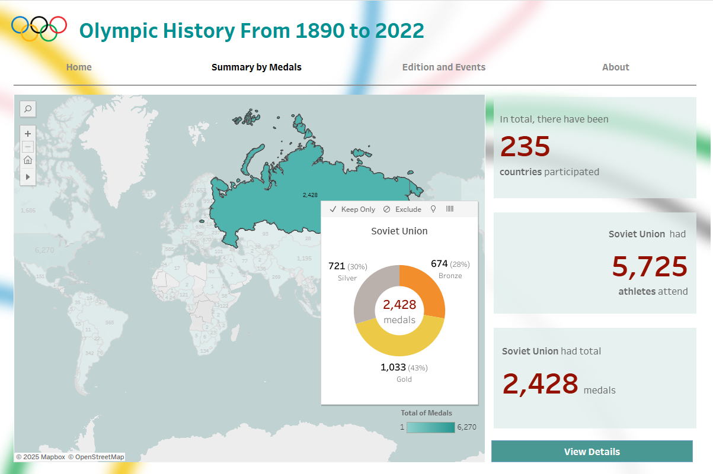
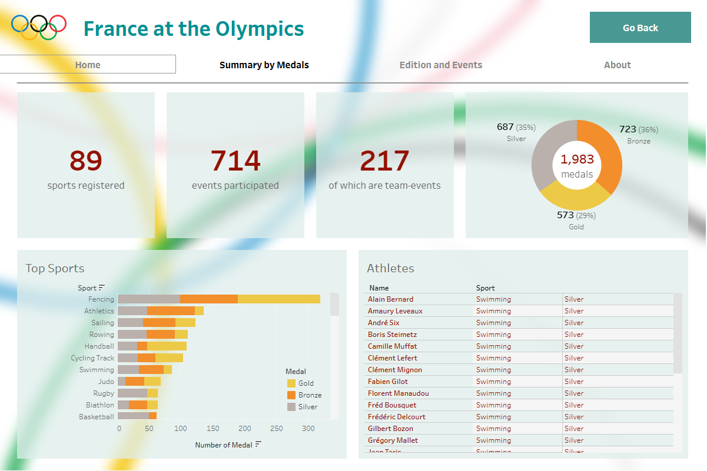
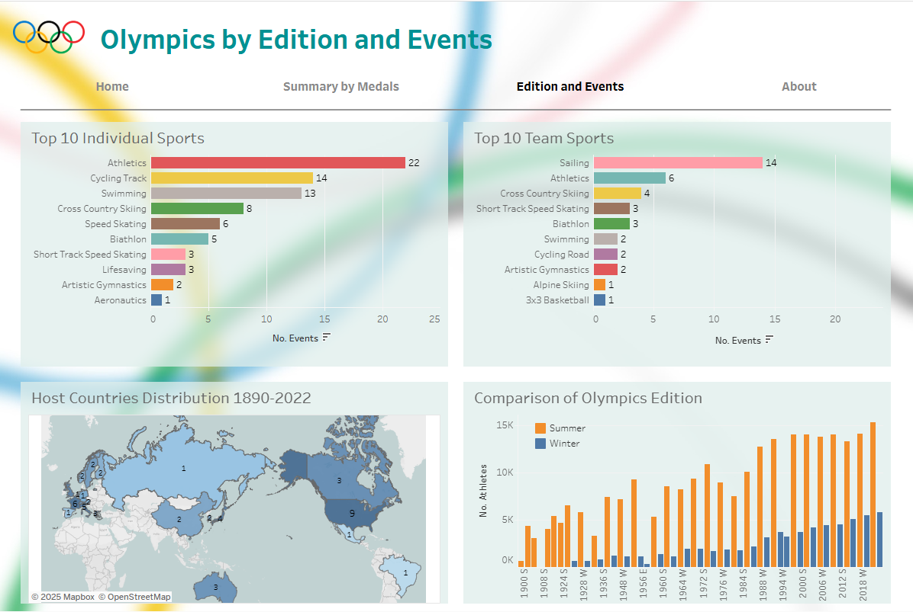

# About the Project: Olympics Dashboard

This repo is about the process of creating a dashboard visualizing Olympic history statistics from 1890 to 2022. The datasets were originally in CSV, and then imported to MySQL server.

Due to the size and complexity of the data, I initially faced difficulties with importing. Even after successfully importing the data, I encountered challenges because the information in the tables was not consistent. Through this dashboard, I hope to showcase my skills and provide insight into my future career direction.

Tableau Public:
- https://public.tableau.com/app/profile/thi.thanh.thuy.nguyen2918/viz/Olympics_15_09/Intro

Resources:
- https://www.olympedia.org/
- https://www.kaggle.com/datasets/josephcheng123456/olympic-historical-dataset-from-olympediaorg
- https://en.wikipedia.org/wiki/Olympic_Games

## Visualization by Coding
Alternatively, a Jupyter Notebook is available to demonstrate data visualization using Python.

The dataset was first cleaned with a Python script, then analyzed and visualized using Pandas and Plotly.

Please go to [src](src) directory for the code and demo.
